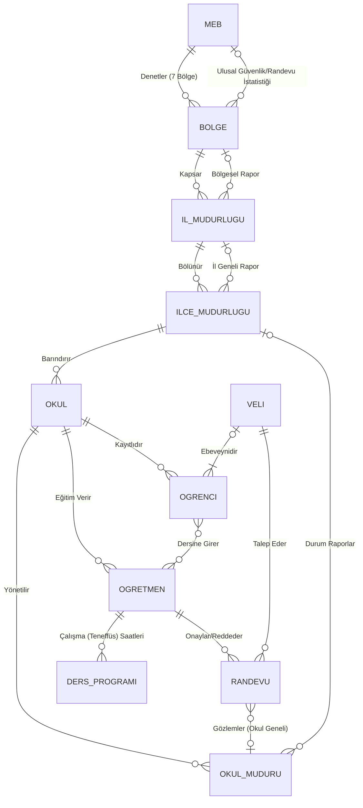
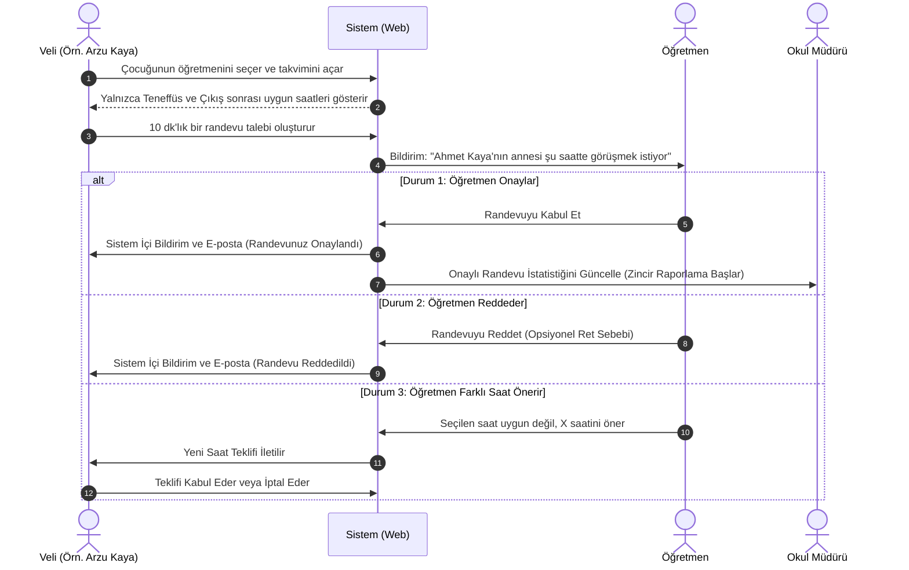

# Öğretmen Randevu Sistemi - Mimari ve Akış Şemaları

Bu belge, okullardaki güvenlik önlemlerini artırmak ve veli-öğretmen iletişimini kayıt altına almak amacıyla tasarlanan sistemin temel veri ve kullanıcı akışlarını içermektedir.

## 1. Kurum Hiyerarşisi (Varlık - İlişki Şeması)

Aşağıdaki şema (ERD), sistemin Türkiye genelini kapsayacak şekilde (MEB -> Bölge -> İl -> İlçe -> Okul) nasıl genişletildiğini göstermektedir. Bu hiyerarşi, e-Devlet veya MEBBİS gibi büyük çaplı bir zinciri temsil eder.

## 2. Temel Randevu Akış Şeması

Bir velinin öğretmenden randevu istediği senaryoda gerçekleşecek olan adım zinciri:

## 3. Ulusal Kullanıcı Rolleri ve Yetki Matrisi

Yenilenmiş sistemdeki devasa ve hiyerarşik kullanıcıların yetki sınırları:

| Rol | Yetkiler | Kısıtlamalar |
| :--- | :--- | :--- |
| **Milli Eğitim Bakanlığı (Süper Karar Alıcı)** | Türkiye haritası üzerindeki o anki tüm okul güvenliği / yoğunluğu verisini makro analizlerle görür. "Bugün Türkiye genelinde kaç veli okula girdi?" | Bireysel (Ahmet, Ayşe vs.) işlemlerle ilgilenmez. "Büyük Veri" (Big Data) izler. |
| **Bölge / İl / İlçe Milli Eğitim Md.** | Kendi yetki alanındaki alt müdürlükleri/okulları sisteme kaydeder/denetler. Grafikler üzerinden ilinde işlerin iyi gidip gitmediğini görür. | Başka bölge, il veya ilçelerin panellerine erişemez. |
| **Okul Yönetimi (Müdür / Yrd)** | Sistemde kendi okulundaki öğretmenleri onaylar. Okul içine o gün fiziki olarak girecek velilerin listesini inceler. (Güvenlik birimi ile de paylaşabilir). | Kendi okulu dışındaki kurumlara hiçbir şekilde müdahale edemez. |
| **Öğretmen** | Müsaitlik takvimini ve anlık talep kotasını (Örn. Aynı saat için en fazla 3 istek gelsin) belirler. Gelen talepleri tek tuşla kabul/ret/erteleme yapar. | Sınırları tamamen yetki alanı olan öğrencileri ile kısıtlıdır. Yönetim paneli özellikleri yoktur. |
| **Veli** | Çocuğunun bağlı bulunduğu öğretmen havuzuna erişir, randevu talep sistemini kullanır, randevusu olmadan "Okula giriş onayı" alamaz. | Randevu onaylanmadan okul yönetimi listelerine düşemez. Başka öğrencileri ve velileri göremez. |
| **Öğrenci** | Sistemde arka planda kayıtlı olan "Referans Veri"dir. Öğretmen ile veliyi birbirine bağlayan köprüdür. | Yazılımda herhangi bir kullanıcı arayüzü veya şifresi yoktur. |
